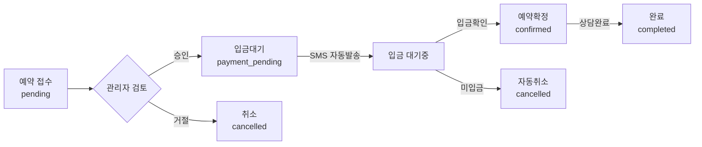

# SMS 시스템 아키텍처 설계

## 1. 데이터베이스 스키마

### 1.1 SMS 템플릿 테이블 (sms_templates)
```sql
CREATE TABLE sms_templates (
  id UUID PRIMARY KEY DEFAULT uuid_generate_v4(),
  name VARCHAR(100) NOT NULL, -- 템플릿 이름 (예: "예약확정", "입금안내")
  office VARCHAR(20) NOT NULL CHECK (office IN ('천안', '평택', '공통')),
  type VARCHAR(50) NOT NULL, -- 'booking_confirmed', 'payment_pending', 'reminder' 등
  subject VARCHAR(100), -- 템플릿 제목 (관리용)
  content TEXT NOT NULL, -- 템플릿 내용 (변수 포함)
  variables JSONB DEFAULT '[]', -- 사용 가능한 변수 목록
  is_active BOOLEAN DEFAULT true,
  message_type VARCHAR(10) DEFAULT 'SMS' CHECK (message_type IN ('SMS', 'LMS')),
  version INT DEFAULT 1,
  created_at TIMESTAMP WITH TIME ZONE DEFAULT NOW(),
  updated_at TIMESTAMP WITH TIME ZONE DEFAULT NOW(),
  created_by UUID REFERENCES auth.users(id),

  -- 복합 유니크 키: 사무소별 타입별로 활성화된 템플릿은 하나만
  UNIQUE(office, type, is_active) WHERE is_active = true
);

-- 인덱스
CREATE INDEX idx_sms_templates_office_type ON sms_templates(office, type);
CREATE INDEX idx_sms_templates_active ON sms_templates(is_active);
```

### 1.2 SMS 발송 로그 테이블 (sms_logs)
```sql
CREATE TABLE sms_logs (
  id UUID PRIMARY KEY DEFAULT uuid_generate_v4(),
  booking_id UUID REFERENCES bookings(id),
  template_id UUID REFERENCES sms_templates(id),
  recipient_phone VARCHAR(20) NOT NULL,
  recipient_name VARCHAR(50),
  message_type VARCHAR(10) NOT NULL, -- 'SMS' or 'LMS'
  content TEXT NOT NULL, -- 실제 발송된 내용
  status VARCHAR(20) NOT NULL, -- 'pending', 'sent', 'failed', 'delivered'
  provider VARCHAR(20) DEFAULT 'solapi',
  provider_message_id VARCHAR(100), -- 솔라피 메시지 ID
  error_message TEXT,
  cost DECIMAL(10, 2), -- 발송 비용
  sent_at TIMESTAMP WITH TIME ZONE,
  delivered_at TIMESTAMP WITH TIME ZONE,
  created_at TIMESTAMP WITH TIME ZONE DEFAULT NOW(),

  -- 메타데이터
  metadata JSONB DEFAULT '{}'
);

-- 인덱스
CREATE INDEX idx_sms_logs_booking ON sms_logs(booking_id);
CREATE INDEX idx_sms_logs_status ON sms_logs(status);
CREATE INDEX idx_sms_logs_created ON sms_logs(created_at DESC);
```

### 1.3 Bookings 테이블 수정
```sql
-- 기존 bookings 테이블에 추가
ALTER TABLE bookings
ADD COLUMN payment_status VARCHAR(20) DEFAULT 'none'
  CHECK (payment_status IN ('none', 'pending', 'partial', 'completed')),
ADD COLUMN payment_amount DECIMAL(10, 2),
ADD COLUMN payment_due_date DATE,
ADD COLUMN payment_confirmed_at TIMESTAMP WITH TIME ZONE;

-- status enum 수정
ALTER TABLE bookings
DROP CONSTRAINT bookings_status_check,
ADD CONSTRAINT bookings_status_check
  CHECK (status IN ('pending', 'payment_pending', 'confirmed', 'completed', 'cancelled'));
```

## 2. API 설계

### 2.1 SMS 템플릿 API
```typescript
// /app/api/admin/sms-templates/route.ts
GET    /api/admin/sms-templates          // 템플릿 목록
POST   /api/admin/sms-templates          // 템플릿 생성
PUT    /api/admin/sms-templates/[id]     // 템플릿 수정
DELETE /api/admin/sms-templates/[id]     // 템플릿 삭제
POST   /api/admin/sms-templates/preview  // 템플릿 미리보기
POST   /api/admin/sms-templates/test     // 테스트 발송
```

### 2.2 SMS 발송 API
```typescript
// /app/api/sms/route.ts
POST   /api/sms/send                     // 즉시 발송
POST   /api/sms/send-template            // 템플릿 기반 발송
GET    /api/sms/logs                     // 발송 로그 조회
GET    /api/sms/status/[messageId]       // 발송 상태 확인
```

## 3. 파일 구조

```
/app
├── admin/
│   ├── sms-templates/
│   │   ├── page.tsx                    # 템플릿 관리 페이지
│   │   ├── TemplateList.tsx            # 템플릿 목록 컴포넌트
│   │   ├── TemplateEditor.tsx          # 템플릿 편집기
│   │   └── TemplatePreview.tsx         # 실시간 미리보기
│   │
│   └── bookings/
│       ├── BookingDetail.tsx           # 예약 상세 (SMS 발송 버튼 추가)
│       └── PaymentStatusModal.tsx      # 입금대기 상태 변경 모달
│
├── api/
│   ├── admin/
│   │   └── sms-templates/
│   │       ├── route.ts
│   │       ├── [id]/route.ts
│   │       ├── preview/route.ts
│   │       └── test/route.ts
│   │
│   └── sms/
│       ├── route.ts
│       ├── send-template/route.ts
│       └── webhook/route.ts            # 솔라피 웹훅 처리
│
/lib
├── sms/
│   ├── solapi.ts                       # 기존 솔라피 클라이언트
│   ├── templates.ts                    # 템플릿 처리 로직
│   ├── sender.ts                       # SMS 발송 핵심 로직
│   └── variables.ts                    # 변수 치환 유틸
│
└── supabase/
    └── sms.ts                           # SMS 관련 DB 쿼리
```

## 4. 템플릿 시스템 설계

### 4.1 템플릿 변수 시스템
```typescript
// 지원 변수 목록
interface TemplateVariables {
  // 고객 정보
  customerName: string;
  customerPhone: string;

  // 예약 정보
  bookingDate: string;
  bookingTime: string;
  lawyerName: string;
  office: '천안' | '평택';

  // 결제 정보
  paymentAmount?: number;
  paymentDueDate?: string;
  accountNumber?: string;
  accountBank?: string;

  // 기타
  customField1?: string;
  customField2?: string;
}

// 템플릿 예시
const template = `
[법무법인 더율]
안녕하세요 {{customerName}}님,

{{bookingDate}} {{bookingTime}}에
{{office}} 사무소에서 {{lawyerName}} 변호사와의
상담이 확정되었습니다.

상담료: {{paymentAmount}}원
입금계좌: {{accountBank}} {{accountNumber}}
입금기한: {{paymentDueDate}}

문의: 02-1234-5678
`;
```

### 4.2 동적 메시지 타입 선택
```typescript
function getMessageType(content: string): 'SMS' | 'LMS' {
  const byteLength = Buffer.byteLength(content, 'utf-8');
  return byteLength <= 90 ? 'SMS' : 'LMS';
}
```

## 5. 워크플로우 설계

### 5.1 입금대기 상태 플로우


### 5.2 자동화 트리거
```typescript
// Supabase Edge Function 또는 Next.js API
async function onBookingStatusChange(booking: Booking) {
  switch(booking.status) {
    case 'payment_pending':
      await sendPaymentRequestSMS(booking);
      await schedulePaymentReminder(booking); // 24시간 후 리마인더
      break;

    case 'confirmed':
      await sendConfirmationSMS(booking);
      await scheduleConsultationReminder(booking); // 하루 전 리마인더
      break;

    case 'cancelled':
      await sendCancellationSMS(booking);
      break;
  }
}
```

## 6. 관리자 UI/UX 설계

### 6.1 SMS 템플릿 관리 페이지
```typescript
// 주요 기능
- 사무소별 템플릿 필터링
- 템플릿 타입별 그룹화
- 실시간 미리보기 (변수 치환 확인)
- 테스트 발송 기능
- 버전 히스토리 보기
- 활성/비활성 토글
```

### 6.2 예약 관리 통합
```typescript
// 예약 상세 페이지 추가 기능
- 상태 변경 버튼 (입금대기 포함)
- SMS 발송 이력 보기
- 수동 SMS 발송 (템플릿 선택)
- 입금 정보 입력 폼
```

## 7. 구현 우선순위

### Phase 1 (즉시 구현)
1. DB 스키마 마이그레이션
2. SMS 템플릿 CRUD API
3. 기본 템플릿 등록 (입금안내, 예약확정)
4. Booking 상태 변경 시 자동 SMS 발송

### Phase 2 (1주일 내)
5. 관리자 템플릿 관리 UI
6. 템플릿 미리보기/테스트 기능
7. SMS 발송 로그 뷰어
8. 입금대기 워크플로우 완성

### Phase 3 (추후 확장)
9. 예약 리마인더 스케줄러
10. 카카오톡 알림톡 연동
11. SMS 통계 대시보드
12. A/B 테스트 기능

## 8. 보안 및 성능 고려사항

### 8.1 보안
- API 키 환경변수 관리
- Rate limiting (분당 10건)
- 발송 전 전화번호 검증
- Admin 권한 체크

### 8.2 성능
- 템플릿 캐싱 (Redis 또는 메모리)
- 배치 발송 지원
- 비동기 처리 (Queue)
- 실패 시 재시도 (최대 3회)

## 9. 예상 비용 구조

### SMS 비용 (솔라피 기준)
- SMS (90자): 20원/건
- LMS (2000자): 60원/건
- 월 예상 발송량: 500건
- 월 예상 비용: 15,000원

### 비용 최적화
- 자동 SMS/LMS 선택
- 중복 발송 방지
- 템플릿 최적화 (90자 이내 유지)